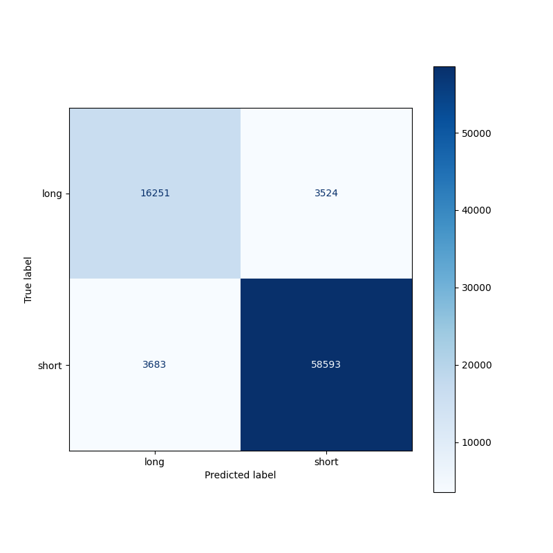

# Recipe Time Category Prediction

**Name(s)**: Ammie Xie

**Website Link**: https://axie0927.github.io/recipe-category-prediction/

### Framing the Problem

For this data science project, continuing on my investigation from my previous project and I am looking to predict the time category of a recipe based on multiple features including the number of ingredients, number of steps, calories, as well as year the recipe is submitted. Using these features, I aim to predict the time category for a recipe. The `time_category` column of the dataframe is categorized by the '60-minutes-or-less' tag. This means that all recipes that take 60 minutes or less to make are considered 'short' while recipes that take more than that are considered 'long'. 

The dataset I am using to investigate this problem is the dataset used in my previous recipes research project. This dataset is obtained from food.com containing different recipes as well as reviews by users on the website reviewing the recipes collected from 2008. The first dataset contains 83782 rows, and 12 columns. 

For this prediction, the variable I will be predicting is the 'time_category' column. This is a categorical outcome which means it is qualitative. It is important to be able to predict the time category of the recipe as it is usually helpful when individuals are looking for a recipe to know whether the recipe can be quickly replicated or it will take a long time to prepare. This allows users to quickly decide whether they want to learn this recipe or not.

In order to make this prediction, I will be using a classification model since the column we are predicting is nominal data. Furthermore this is supervised learning due to the fact that our data is labelled, we are modelling based off the 'time_category' column that I created above. As a result, this will be binary classification since there are only two outcomes 'short' and 'long'.

We will be measuring the accuracy of the model. This is because previously we found out that there are significantly more short recipes than long recipes, leading our distribution to be uneven and thus testing for accuracy would be a fair metric to test the performance of our model. 

I have selected 5 features to investigate, these features include the columns `n_steps`, `n_ingredients`, `calories`, `avg_rating` and `year`. These features with the engineering accordingly in order to maximize the performance of our model. However, these features may not all be used as using too many features may sometimes lead to overfitting. 

### Baseline Model

For the baseline model, I used the features `n_steps`, and `year` on a decision tree classifier model with the predicted column being the `time_category` column. The column `n_steps` is a quantitative numerical column while the `year` column is a categorical column and is treated as nominal data. I chose to standardize my features by applying `StandardScaler` on the column `n_steps`, I also one-hot encoded the column `year` by applying `OneHotEncoder` to the column. The column `year` is derived from the column `submitted` where I extracted only the year in which the recipe is submitted. 

Features Used:

- `n_steps`: The number of steps to the recipe would may affect the time_category of the recipe. Although there is no standardized time as to how long each step will take. The number of steps needed in a recipe gives a good indicator of the how long the recipe will take.
- `year`: The year in which the recipe is submitted may affect the time category of the recipe as more modern recipes require new technology and thus may be more complicated which may have an effect on the time category of the recipe.

I used a decision tree classifier to predict `time_category` for my baseline model. I utilized the import `sklearn` in order to perform this classifier. As mentioned above, I used `StandardScaler` on `n_steps` and `OneHotEncoder` on `year`. I applied these transformations to their respective columns using `ColumnTransformer` and then I created a pipeline containing our column transformer and a classifier. 

Model Performance:

For this model, I seperated the dataset into training and test data using a 65% and 35% split respectively. I fit our model using our training data and tested its performance using the test data. In order to test the performance of my model, I calculated the accuracy using the .score(X, y) function. Additionally, I used a max depth of 2 in my baseline model as I am performing binary classification so I aimed to keep my baseline model simple. 

For this model we obtained a training accuracy of 0.7662785966478101 and a test accuracy of 0.7669498238900196. This is a relatively high accuracy for both training and testing which is a good starting point for us since this means that around 76% of our recipes are correctly classified in their time categories. However, since our accuracy is around 76%, there is still around 24% of recipes that are incorrectly classified. I believe it is possible to achieve a higher accuracy that is around 90%.

### Final Model

For our final model, I have added 3 additional features to the model. These features are `n_ingredients`, `calories` and `avg_rating`. In the final model, I have standardized the columns `avg_rating`, `n_steps`, and `n_ingredients` using `StandardScaler`. Additionally, the `calories` column is log transformed using `FunctionTransformer`. I kept the one-hot encoding for the `year` column as it is the only nominal feature used in my model. 

Features added:

- `avg_rating`: The time category may be related to the average rating of a recipe as recipes that are shorter or longer may have a higher rating. I believe there is a correlation between the time category of a recipe and the average rating for the recipe. For example, some people may prefer shorter recipes and thus recipes that are categorized as 'short' will have a higher rating on average compared to recipes that are categorized as 'long'. 
- `n_ingredients`: The number of ingredients needed in a recipe may be related to the time category as more ingredients usually imply recipes to take longer to make due to the fact it is required to incorporate all the ingredients in the recipe. 
- `calories`: similar to the number of ingredients, the number of calories in a recipe may be correlated to the time category. Longer recipes are usually for heavier meals and thus the number of calories may be higher for recipes that are categorized as 'long' compared to recipes that are categorized as 'short'. 

For this model, I have decided to keep using a decision tree classifier since it gave promising accuracy scores when I ran my baseline model. As mentioned above, I standardized `n_ingredients` and `avg_rating` features and log transformed the `calories` column. This will provide better features for our decision tree classifier since decision trees make splits based on comparisons, with more features we are able to make more comparisions based on multiple different factors giving the model more accurate predictions. 

A grid search was used to find the optimized hyperparameter to allow us to have the highest accuracy in our model. This was done using the imported class `GraphSearchCV` from `sklearn.model_selection`. Since we are using a decision tree classifier model, we are looking for the max-depth in which allows us to have the best accuracy. Using `GridSearchCV` we obtained an optimal maximum depth of 41. I then fit the final model with the max_depth returned by the grid search (max_depth = 41) on the same training data to test its performance in terms of accuracy on both train and test data.

The accuracy obtained from the final model on the training data is 0.9994093635564189 and the accuracy obtained from the final model on the testing data is 0.9120425101461286. These results are significantly better than our baseline model where we had the accuracy of 76% which is relatively good by itself but with our final model, we now have an accuracy of 90%+ for both training and test data which is remarkably better than our previous accuracy and exactly what we have aimed to achieve. With a 90% accuracy, this means that 90% of the data is predicted correctly while only 10% is predicted incorrectly. 

Below is a dataframe of how the grid search was conducted. I tested the value in max_depth from 1 to 50 (inclusive).

Additionally, I have provided a confusion matrix to show a visualization of the performance of the final model. 

### Fairness Analysis

Indeed, the final model has a high accuracy when predicting the overall time category for a recipe. However, it is important to note that a majority of recipes are labeled as `short` since we used the '60-minutes-or-less' tag to determine the category of the recipe. Thus, recipes that took 60 minutes or less were categorized as 'short' while recipes that took longer were categorized as 'long'. This caused an uneven split since there were significantly more recipes that were categorized as 'short' compared to 'long'. This would imply that our model does better predicting 'short' recipes since we have more data to work with and thus, we would like to test whether the final model does better at classifying recipes that are considered 'short' as opposed to recipes that are considered 'long'. 

In order to investigate this, a permutation test will be conducted where the recipes that are categorized as 'short' will be shuffled as group A, while recipes that are categorized as 'long' are shuffled as group B. 

Group A: Recipes categorized 'short'

Group B: Recipes categorized 'long'

The evaluation metric I will be using for this test is the recall which will be calculated using (TP / (TP + FN)) or (TN / (TN + FP)). This is because we want to see how whether 'short' is correctly classified more often than 'long'.

Null Hypothesis (H0): Our model is fair, its recall when classifying the time category of recipes are roughly the game for both group A and group B, and any differences are likely due to chance.

Alternative Hypothesis (H1): Our model is not fair, its recall when classifying the time category of recipes is higher for recipes in group A when compared to group B.

Significance Level: The significance level I set for this permutation test is 0.05.

After conducting a permutation test 100 times, we obtain the p-value of 1.0 which is greater than our significance level of 0.05. This suggests that we fail to reject our null hypothesis and accept that our model is fair. This goes against my initial suspicion that my model classifiers 'short' with higher recall than 'long'. This result may suggest that our model is fair and its recall when classifying the time category of recipes are roughly the game for both group A and group B, and any differences are likely due to chance. However it is impossible to make a 100% conclusive decision and the result we obtained only suggests that our model is fair.